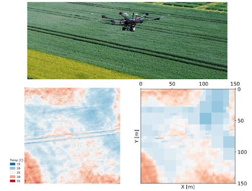

# Adaptive-Resolution Field Mapping Using Gaussian Process Fusion with Integral Kernels

Liren Jin<sup>1</sup>, Julius Rückin<sup>1</sup>, Stefan H. Kiss<sup>2</sup>, Teresa Vidal-Calleja<sup>2</sup>, Marija Popovic<sup>1</sup><br>

<sup>1</sup> University of Bonn, <sup>2</sup> University of Technology Sydney

This repository contains the implementation of our paper "Adaptive-Resolution Field Mapping Using Gaussian Process Fusion with Integral Kernels" accepted by RA-L + IROS2022.

  

## Environment Setup
```commandline
git clone git@github.com:dmar-bonn/argpf_mapping.git
cd argpf_mapping
conda env create -f environment.yaml
conda activate argpf_mapping
```
## Run Experiment
for running mapping experiments:
```commandline
python main.py -E mapping
```
for planning experiments:
```commandline
python main.py -E planning --record_metrics
```

the configuration files for experimental setup can be found in config folder. Note that the slow running time is due to analysing experiment data. If the data analysis is not needed, use --test_run in commandline. For planning experiment, we record metrics after each map update to get the metrics development over mission time, which is pretty slow. You can omit record_metrics in commandline to avoid this.
## Maintainer
Liren Jin, ljin@uni-bonn.de
## Citation
```commandline
@ARTICLE{9797797,
  author={Jin, Liren and Rückin, Julius and Kiss, Stefan H. and Vidal-Calleja, Teresa and Popović, Marija},
  journal={IEEE Robotics and Automation Letters}, 
  title={Adaptive-Resolution Field Mapping Using Gaussian Process Fusion With Integral Kernels}, 
  year={2022},
  volume={7},
  number={3},
  pages={7471-7478},
  doi={10.1109/LRA.2022.3183797}}
```

## Project Funding
This work has been fully funded by the Deutsche Forschungsgemeinschaft (DFG, German Research Foundation) under Germany’s Excellence Strategy, EXC-2070 – 390732324 (PhenoRob)

